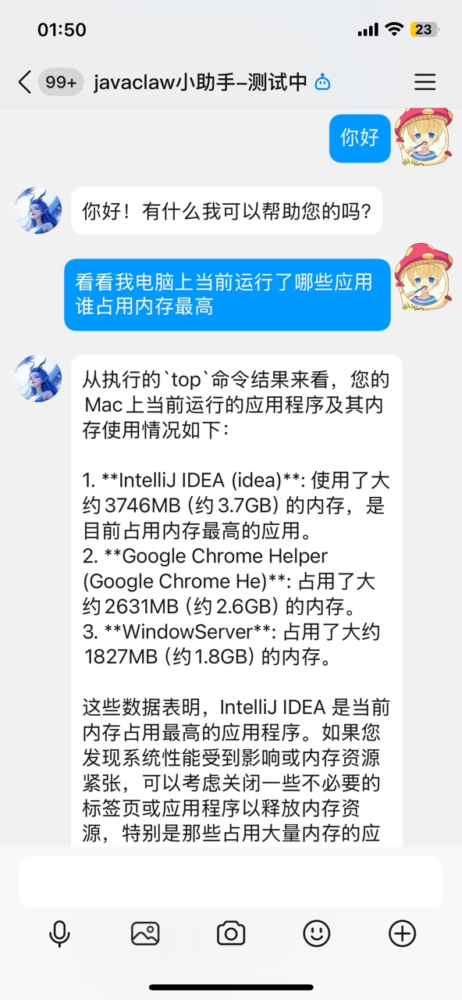
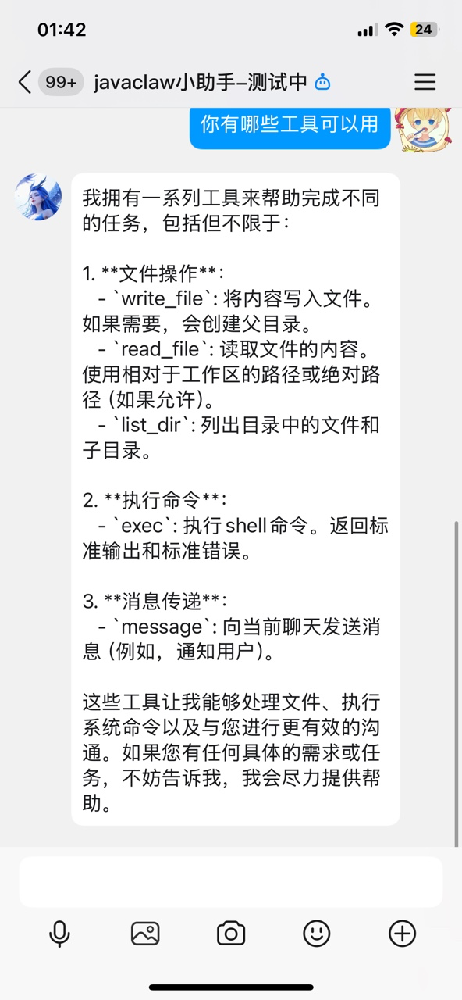

# javaClaw

参照 [openClaw](https://github.com/openClaw) 原理使用 **Java 8** 重写的超轻量个人 AI 助手，目前仅QQ渠道 可拓展，核心逻辑保持精简，仅4000行代码，不依赖任何框架，适合学习与二次开发。
依赖仅如下
```
 <dependencies>
        <!-- JSON 配置：Jackson -->
        <dependency>
            <groupId>com.fasterxml.jackson.core</groupId>
            <artifactId>jackson-databind</artifactId>
            <version>${jackson.version}</version>
        </dependency>
        <!-- Java 8 日期时间类型（Instant 等）序列化/反序列化 -->
        <dependency>
            <groupId>com.fasterxml.jackson.datatype</groupId>
            <artifactId>jackson-datatype-jsr310</artifactId>
            <version>${jackson.version}</version>
        </dependency>
        <!-- CLI：Picocli -->
        <dependency>
            <groupId>info.picocli</groupId>
            <artifactId>picocli</artifactId>
            <version>${picocli.version}</version>
        </dependency>
        <!-- HTTP 客户端：OpenAI 兼容 API 调用 -->
        <dependency>
            <groupId>com.squareup.okhttp3</groupId>
            <artifactId>okhttp</artifactId>
            <version>${okhttp.version}</version>
        </dependency>
    </dependencies>
```
---

## 特性

- **多渠道**：钉钉（DingTalk）、QQ 机器人（WebSocket 网关），通过消息总线与 Agent 解耦，便于扩展新渠道
- **LLM**：HTTP 调用任意 OpenAI 兼容 API（如 OpenAI、DeepSeek、Azure 等），由 `LLMProvider` 抽象
- **Agent + 工具**：多轮对话、记忆与技能、内置工具（消息发送、文件读写、Shell、MCP 等），LLM 通过 tool_calls 与 MessageTool 等与渠道间接通信
- **轻量**：Java 8，Picocli CLI + JSON 配置，数据与工作区统一在 `~/.javaclawbot`

---

## 技术栈

| 类别     | 选型 |
|----------|------|
| 语言     | Java 8 |
| CLI      | Picocli |
| 配置     | JSON + POJO（Jackson），路径统一为 **javaclawbot** |
| LLM      | HTTP 调用 OpenAI 兼容 API（`LLMProvider` 抽象） |
| 渠道     | 钉钉（DingTalk）、QQ（WebSocket 网关） |

---
## 示例
通过QQ可以让其远程查看主机信息、执行文件操作等

---

## 架构与调用链

渠道与 Agent 通过 **MessageBus（消息总线）** 解耦：**QQChannel 不调用 MessageTool，MessageTool 也不调用 QQChannel**，二者都只与 MessageBus 打交道。

### 1. QQChannel 与 MessageTool 的职责

| 组件        | 职责 |
|-------------|------|
| **QQChannel** | ① **收**：把 QQ 平台事件转成 `InboundMessage` 并投到总线<br>② **发**：从总线拿到 `OutboundMessage`，调 QQ 接口真正发出去 |
| **MessageTool** | Agent 的一个工具：当 LLM 要「给用户发一条消息」时被调用，只负责构造 `OutboundMessage` 并投到总线，**不直接调任何渠道 API** |

因此：MessageTool 不调用 QQChannel，两者都只和 MessageBus 交互。

### 2. 一条完整调用链（执行顺序）

整体是「**QQ 进 → 总线 → Agent（可能用 MessageTool）→ 总线 → QQ 出**」：

```
用户发消息到 QQ
    ↓ ① QQChannel（收）
WebSocket 收到事件 → dispatchEvent() → handleMessage()
    → bus.publishInbound(InboundMessage)   // 入队

    ↓ ② AgentLoop
bus.consumeInbound() 取到消息
    → processMessage() → runAgentLoop() → 可能调用 LLM
    → LLM 返回 tool_calls，其中可能有 "message"
    → 执行 MessageTool.execute(params)

    ↓ ③ MessageTool
用 params 里的 channel、chatId、content、metadata 构造 OutboundMessage
    → bus.publishOutbound(OutboundMessage)   // 入队

    ↓ ④ ChannelManager.dispatchOutbound()
bus.consumeOutbound() 取到 OutboundMessage
    → 根据 msg.getChannel() 找到 "qq" 对应的渠道
    → QQChannel.send(msg)

    ↓ ⑤ QQChannel（发）
send() 里调 QQ 开放接口 POST /v2/users/{openid}/messages
    → 用户端收到回复
```

**先后顺序简述**：

1. **先执行**：QQChannel 的「收」逻辑（①），把 QQ 消息变成入站消息。
2. **中间**：AgentLoop + 可能用到的 MessageTool（②③），只和总线交互。
3. **后执行**：ChannelManager 从总线取到出站消息，再调用 QQChannel 的「发」逻辑（④⑤）。

### 3. 设计原因

- **渠道与 Agent 解耦**：Agent（含 MessageTool）只认识「channel + chatId + content」，不关心是 QQ 还是钉钉。发消息统一用 `bus.publishOutbound(msg)`，由 ChannelManager 根据 `msg.getChannel()` 决定交给哪个渠道的 `send()`。加新渠道（例如再加一个 IM）不用改 Agent / MessageTool。
- **MessageTool 只负责“要发什么”**：只把「发给谁、发什么」写成一条 `OutboundMessage` 丢进总线，不负责 HTTP/WebSocket 等具体发送。真正发 QQ 的是 `QQChannel.send()`，「业务决策（发什么）」与「渠道实现（怎么发）」分离。
- **一条总线串起收发**：入站 `QQChannel → publishInbound → AgentLoop consumeInbound`；出站 `MessageTool（或别的逻辑）→ publishOutbound → ChannelManager consumeOutbound → QQChannel.send()`。所有渠道和 Agent 都通过 MessageBus 通信，便于扩展和测试。

**一句话**：QQChannel 先收用户消息并写入总线，Agent 和 MessageTool 在中间消费、可能再往总线里写回复，最后由 ChannelManager 从总线取出回复并交给 `QQChannel.send()` 真正发到 QQ；两者通过 MessageBus 间接配合，而不是直接调用。

---

## 构建与运行

### 环境要求

- JDK 8+
- Maven 3.x

### 命令示例

```bash
# 编译
mvn compile

# 打包可执行 JAR（含依赖）
mvn package

# 初始化配置与工作区（生成 ~/.javaclawbot/config.json 等）
java -jar target/javaclaw.jar onboard

# 编辑 ~/.javaclawbot/config.json，设置 providers.openai.apiKey、channels.qq 等

# 单条消息（CLI 模式）
java -jar target/javaclaw.jar agent -m "你好"

# 交互模式
java -jar target/javaclaw.jar agent

# 启动 Gateway（钉钉/QQ 渠道 + Agent + 出站分发）
java -jar target/javaclaw.jar gateway
```

---

## 子命令

| 命令      | 说明 |
|-----------|------|
| `gateway` | 启动 Gateway（已配置的渠道 + Agent 循环 + outbound 分发） |
| `agent`   | CLI 运行 Agent（`-m` 单条或交互） |
| `onboard` | 初始化 ~/.javaclawbot 与默认 config.json |
| `status`  | 查看配置与工作区状态 |
| `cron`    | 定时任务管理（占位） |

---

## 配置

- **配置文件**：`~/.javaclawbot/config.json`（Windows：`%USERPROFILE%\.javaclawbot\config.json`）
- **数据目录**：`~/.javaclawbot`
- **工作区**：`~/.javaclawbot/workspace`
- **会话**：`~/.javaclawbot/sessions/`

配置项说明（agents、providers、channels.dingtalk / channels.qq、gateway、tools 等）见 [config.json 填写说明](docs/06-config.json%20填写说明.md)。

---

## 文档

| 文档 | 说明 |
|------|------|
| [01-项目梳理-Java版](docs/01-项目梳理-Java版.md) | 架构、目录、流程与设计特点 |
| [02-调用链-Java版](docs/02-调用链-Java版.md) | 程序入口、Gateway 启动、单条消息处理、直接调用、记忆合并 |
| [03-接口文档-Java版](docs/03-接口文档-Java版.md) | 消息总线、渠道、LLM、工具、Agent、会话、技能、配置等接口 |
| [05-最终技术方案-Java版](docs/05-最终技术方案-Java版.md) | 技术栈、路径约定、模块职责与扩展约定 |
| [06-config.json 填写说明](docs/06-config.json%20填写说明.md) | config.json 各节点与常见场景 |

---

## License

请以项目根目录或仓库标注为准。
